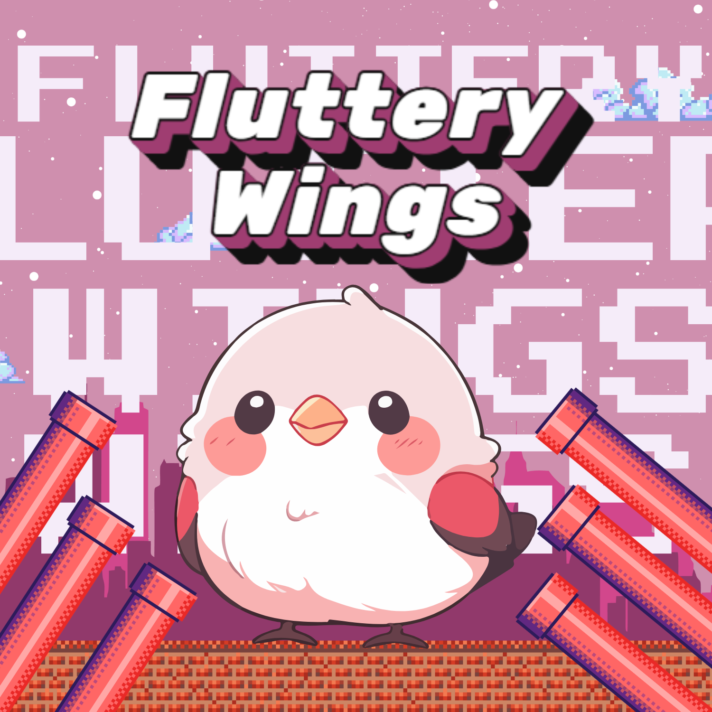

# Fluttery Wings

Fluttery Wings is a fun and engaging 2D game built using Unity. It showcases unique gameplay mechanics and custom-designed assets, providing an exciting experience for players. This project is a testament to creativity and skill in game development.



## Features

- **Custom Assets**: Unique visuals crafted specifically for the game.
- **C# Scripting**: Core mechanics and gameplay logic implemented in C#.
- **Responsive Controls**: Smooth and interactive gameplay.

## Technologies Used

- **Unity 2D**: Game engine for design and development.
- **C#**: For scripting game mechanics and interactions.

## Installation and Setup

1. Clone the repository:
   ```bash
   git clone https://github.com/Hareem-Gohar/Fluttery-Wings.git
